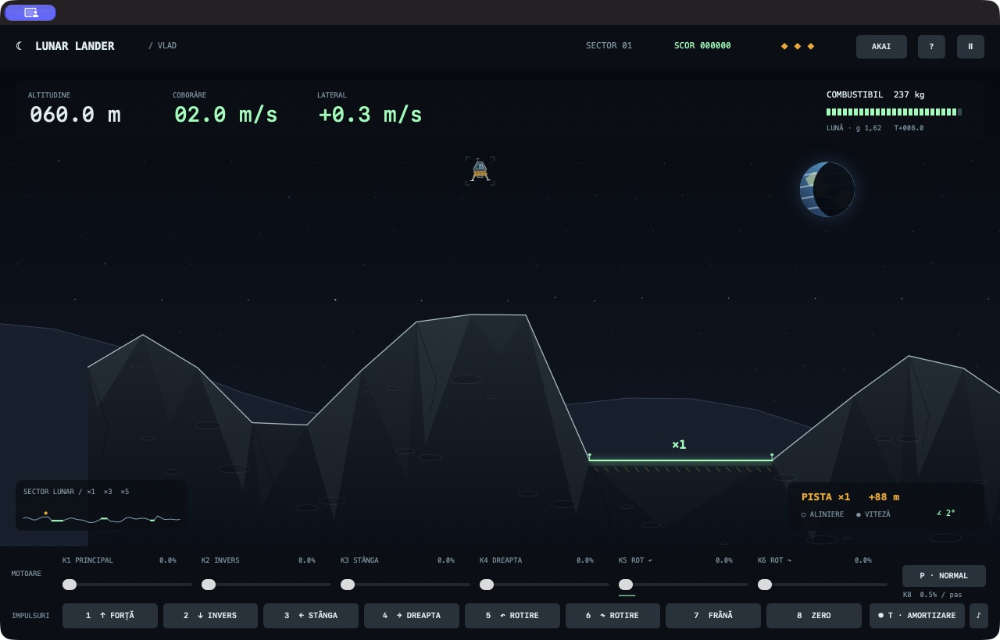

# LunarLander By Vlad

Un joc de aterizare pe Lună pentru **Mac cu procesor Apple M1 sau mai nou și macOS 13 sau mai nou**. Folosește un AKAI MPK mini IV sau joacă direct cu tastatura și mouse-ul. Funcționează offline, în română.

## Descarcă și instalează pe Mac

**[⬇ Descarcă jocul pentru Mac (.DMG)](https://github.com/atomicpig/LunarLander-By-Vlad/releases/latest/download/Lunar-Lander-Vlad-2.0.0-macOS-arm64.dmg)**

Nu ai nevoie de Terminal, Xcode, cont GitHub sau cunoștințe de programare.

1. **Descarcă** jocul folosind butonul de mai sus.
2. În Finder, deschide **Downloads / Descărcări** și dă dublu clic pe fișierul descărcat.
3. În fereastra care apare, **trage pictograma „Lunar Lander Vlad” peste „Applications”**. Așteaptă să se termine copierea.
4. Deschide **Applications / Aplicații** în Finder și dă dublu clic pe **Lunar Lander Vlad**.
5. Apasă **Lansează**. Dacă ai AKAI, conectează-l prin USB; poți juca și fără el.


### Dacă Mac-ul blochează prima deschidere

Aplicația nu este notarizată de Apple, deci macOS poate cere o confirmare suplimentară:

1. Închide mesajul de avertizare, fără să alegi „Move to Trash”.
2. Deschide **meniul Apple  → System Settings / Configurări sistem → Privacy & Security / Intimitate și securitate**.
3. Derulează la mesajul despre joc și apasă **Open Anyway / Deschide oricum**.
4. Confirmă **Open / Deschide**. La pornirile următoare este suficient un dublu clic pe joc.

[Vezi ghidul ilustrat complet](docs/INSTALARE.md) · [Instrucțiunile oficiale Apple](https://support.apple.com/en-au/102445)

**Ai un Mac compatibil?** Meniul Apple  → **About This Mac / Despre acest Mac** arată procesorul și versiunea macOS. Această versiune este pentru procesoare Apple M, nu Intel. Pe un Mac administrat de școală poate fi necesar ajutorul administratorului.

Dacă folosești [pagina Releases](https://github.com/atomicpig/LunarLander-By-Vlad/releases/latest), alege fișierul **`.dmg`** din lista **Assets**. „Source code” este pentru dezvoltatori. Există și o variantă ZIP: o deschizi și muți aplicația rezultată în Applications.


## Cum joci

Ai **3 vieți** și **250 kg de combustibil**. Alege una dintre cele trei piste luminoase: **×1** este largă, **×3** este mai dificilă, **×5** cere precizie. Aterizarea deschide următorul sector, adaugă până la 45 kg de combustibil și multiplică punctele. Pistele se îngustează progresiv. Recordul se salvează pe Mac.

Comenzile ajung la motoare în următorul pas fizic, fără rampă de pornire. Cockpitul folosește controale native și desenare directă, pentru ca butoanele să nu întrerupă zborul.

Motoarele schimbă viteza: reducerea puterii nu oprește deplasarea. Cu nava verticală, **K1 la circa 10–11%** compensează gravitația; ajustează în funcție de combustibil. Pornește cu pista ×1. Lasă inerția să te ducă spre ea, apoi frânează devreme cu Pad 7 și dozează K1.

La contact, ambele picioare trebuie să fie deasupra aceleiași piste: **≤ 6 m/s vertical, ≤ 3 m/s lateral, ≤ 15° înclinare, ≤ 0,5 rad/s rotație**. Suspensia acceptă un contact ferm. O aterizare mai lentă aduce mai multe puncte. Carena nu trebuie să lovească solul.



## Comenzile AKAI

| Control | Acțiune | Alternativă |
|---|---|---|
| K1 / K2 | Motor principal / invers, 0–100% | Cursoare; W / S țin motorul |
| K3 / K4 | Propulsie spre stânga / dreapta | Cursoare; A / D |
| K5 / K6 | Rotație stânga / dreapta | Cursoare; Q / E |
| K7 | Zoom manual | Glisor în `?`; C comută camera automată |
| K8 | Precizia potențiometrelor: 0,1–1% pe pas lent | Glisor în `?`; P comută fin / normal |
| Pad 1–6 | Impuls în aceeași direcție ca K1–K6, **0,24 s la 160%**, adăugat puterii existente | Tastele 1–6 sau butoanele de jos |
| Pad 7 | Frânare cu propulsoare, 0,55 s | 7 / B |
| Pad 8 | Zero: oprește motoarele, impulsurile și amortizarea | 8 / X |
| Pitch / Mod | Rotație fină / puterea clapelor | Q / E; cursoare |
| Clape C D E F G A | Aceleași șase motoare, cât timp ții clapa | W S A D Q E |

**Padurile nu trebuie ținute apăsate.** Fiecare apăsare pornește un impuls finit; așteaptă efectul înainte de următoarea corecție. Frânarea consumă combustibil și nu anulează instantaneu viteza. Modulation nu afectează dials sau paduri.

**Spațiu**: pauză / continuă. **Esc**: pauză. **R**: reia cu confirmare, costă o viață. **T**: amortizează rotația folosind combustibil, păstrând unghiul ales. Pentru ecran complet folosește butonul verde al ferestrei.

### Dacă un potențiometru nu răspunde

Deschide **AKAI**. Folosește modul DAW pe MPK mini IV; dezactivează ARP, LATCH, NOTE REPEAT, CHORDS și SCALES. Profilul implicit folosește K1–K8 de pe portul DAW, iar clapele și padurile de pe portul MIDI. Comanda primită se evidențiază în ecran.

Poți reasocia: alege tipul encoderului, apasă pe funcție și mișcă acel control. Pentru MPK mini IV în modul DAW, folosește **Relativ · +1 / 127**. O asociere include portul, canalul și tipul mesajului. Profilul se salvează automat. La pauză, deconectare sau pierderea focusului, motoarele sunt aduse la zero. Potențiometrele absolute trebuie readuse la zero înainte de reluare.

## Ce înlocuiește

Versiunea 2.0 înlocuiește complet jocul anterior „Proiectul de fizică al lui Vlad”. Proiectul se numește acum LunarLander By Vlad; vechea adresă GitHub redirecționează spre noua pagină. Aplicația are un nume nou; poți elimina vechea aplicație din Applications. Asocierile AKAI salvate se importă automat, cu noile funcții ale padurilor. Recordul începe separat. Misiunile educative și laboratorul vechi nu mai fac parte din joc.

<details>
<summary>Pentru dezvoltatori (opțional)</summary>


```sh
swift build
swift run VladLander
bash scripts/test.sh
bash scripts/package.sh
```

Swift 5.9+, Swift Package Manager, macOS 13+. Testele necesită Xcode complet. Fizica din `Sources/FlightCore/` folosește unități SI și pas fix de 1/120 s, separat de UI și de CoreMIDI. Randarea și cockpitul folosesc AppKit/CoreGraphics; SwiftUI este folosit pentru dialoguri. Nu există dependențe externe. `VLAD_VERSION=2.0.1 bash scripts/package.sh` schimbă versiunea arhivelor. Vezi [AGENTS.md](AGENTS.md), [verificările](docs/VERIFICARE.md) și [notele versiunii](docs/RELEASE_NOTES.md).

</details>

Grafică vectorială și sunete originale. Proiect independent, fără afiliere cu Atari sau AKAI. Cod distribuit sub [licența MIT](LICENSE).
