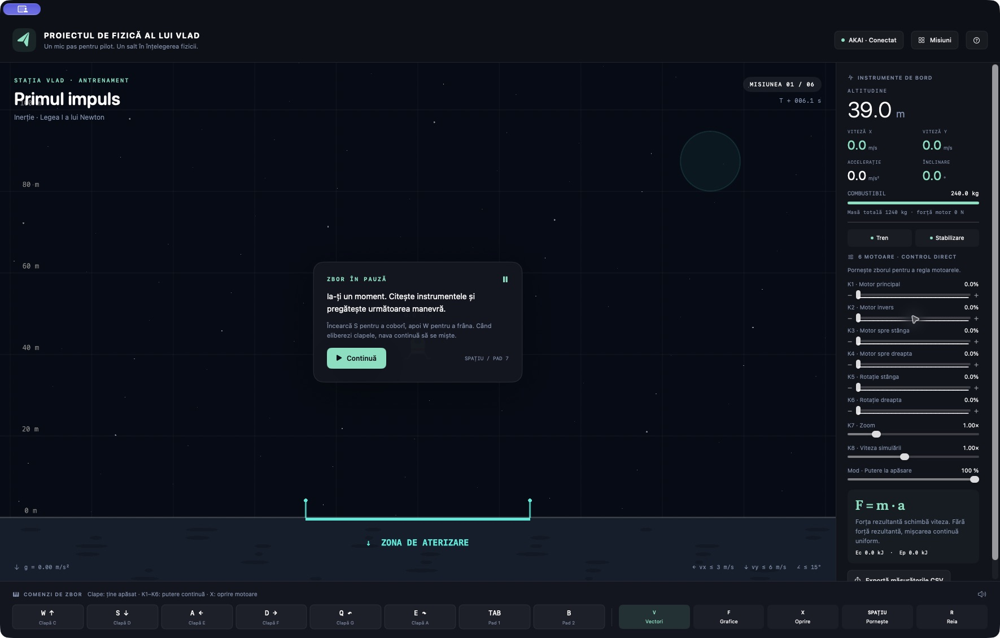

# Proiectul de fizică al lui Vlad 🚀

Un joc de fizică în română, pentru **Mac cu procesor Apple M1/M2/M3/M4 sau mai nou** și **macOS 13+**. Pilotează o navă cu **AKAI MPK mini IV**, aterizează pe planete diferite și transformă zborul într-un experiment de liceu.

**Funcționează offline. Nu ai nevoie de Terminal, Xcode, Python, un cont sau software muzical.** Poți juca și fără AKAI, folosind tastatura și mouse-ul.

## Descarcă și pornește

### [⬇ Descarcă aplicația pentru Mac — ultima versiune](https://github.com/atomicpig/proiectul-de-fizica-al-lui-vlad/releases/latest)

1. Din pagina de mai sus, descarcă fișierul care se termină în **`macOS-arm64.dmg`**, din secțiunea **Assets**. Nu ai nevoie de „Source code”.
2. Deschide fișierul `.dmg` și trage **Proiectul de fizica al lui Vlad** în **Applications / Aplicații**.
3. Deschide aplicația din Applications. Prima versiune nu este notarizată Apple. Dacă macOS o blochează, apasă Done, apoi mergi la **System Settings → Privacy & Security → Open Anyway**, confirmă și redeschide aplicația. Nu dezactiva protecțiile sistemului.
4. Alege **Încep cu tastatura** sau **Configurează AKAI**. Apasă **Spațiu** pentru a porni prima misiune.

Există și o arhivă `.zip`: dezarhivează și mută aplicația în Applications. Pe Mac-urile administrate de școală/companie, politica administratorului poate împiedica deschiderea aplicațiilor nenotarizate.

**[Ghid ilustrat de instalare](docs/INSTALARE.md)** · [Instrucțiunile oficiale Apple](https://support.apple.com/en-au/102445)



## Ce conține

- Șase misiuni: inerție, Lună, Marte, transport greu, atmosferă terestră și aterizare cu combustibil limitat.
- Laborator cu gravitație, masă, rezistență a aerului și viteză de simulare reglabile.
- Vectori de viteză și forță, grafice de altitudine/viteză/energie și export CSV în unități SI.
- Stabilizare și frânare care folosesc propulsoare și consumă combustibil.
- Profil MIDI și progres salvate local, fără colectare de date sau conexiune la internet.

## Conectează AKAI MPK mini IV

1. Conectează controllerul prin USB. Nu instala un DAW pentru acest joc.
2. Pe AKAI, alege modul **DAW** cu butonul PLUGIN/DAW. Oprește **ARP, LATCH, NOTE REPEAT, CHORDS și SCALES** și resetează octava (OCT − și OCT + împreună).
3. **Profilul MPK mini IV se încarcă automat.** K1–K8 folosesc portul DAW, canalul 1, CC 24–31, în mod relativ; clapele și padurile folosesc portul MIDI. Apasă Spațiu și rotește K1–K6. Mișcările lente reglează puterea cu 0,5% pe pas; accelerația mișcărilor rapide este temperată pentru a evita salturile bruște. Butoanele ± de pe ecran permit ajustări de 0,1%.
4. Pentru un USER preset personalizat sau alte note/canale, apasă un card în ecranul **AKAI**, apoi mișcă controlul dorit. Există și **Asociază toate · 24 pași**. Selectează modul Absolut/Relativ potrivit înainte de asocierea potențiometrelor. Jocul păstrează asocierile personalizate și nu rescrie controllerul.

Clapele și padurile care emit aceeași notă trebuie să folosească **canale MIDI diferite**. Un card poate fi reasociat individual; click dreapta pe el șterge asocierea. Dacă schimbi presetul sau octava, verifică din nou comenzile. Numele porturilor pot diferi între versiuni de firmware; reasociază după o astfel de schimbare.

| AKAI | Acțiune | Tastatură / mouse |
|---|---|---|
| Clape C, D, E, F, G, A | Motor principal/invers, lateral stânga/dreapta, rotație stânga/dreapta | W, S, A, D, Q, E; săgeți pentru translație |
| Pad 1 / 2, ținute | Impuls suplimentar / frânare | Tab / B |
| Pad 3 / 4 | Stabilizare / tren de aterizare | T / G |
| Pad 5 / 6 | Vectori / grafice | V / F |
| Pad 7 / 8 | Pauză / oprirea tuturor motoarelor | Spațiu / X |
| K1 / K2 | Putere motor principal / invers, independent 0–100% | Cursoare și ± în pași de 0,1% |
| K3 / K4 | Putere motor lateral stânga / dreapta | Cursoare și ± în pași de 0,1% |
| K5 / K6 | Putere rotație stânga / dreapta | Cursoare și ± în pași de 0,1% |
| K7 / K8 | Zoom / viteza simulării | Cursoare în panoul drept |
| Pitch / Mod | Rotație fină / putere la apăsare | Q/E / cursorul Mod |

**Pilotajul principal se face din K1–K6:** fiecare potențiometru setează permanent puterea unui motor între 0 și 100%, fără să ții o clapă apăsată. Motoarele pot funcționa simultan. Clapele rămân o alternativă temporară, cât sunt apăsate. La revenirea unui potențiometru la zero, o clapă ținută poate comanda în continuare acel motor.

Motorul principal dezvoltă cel mult 18 kN, cel invers 6 kN, cele laterale 4 kN, iar propulsoarele de rotație câte 1,8 kNm. Reglajele mici se aplică imediat în simulare; creșterile mari ajung de la 0 la 100% în 0,4 s. Reducerile de putere sunt imediate. **Mod afectează numai clapele**, nu motoarele comandate din potențiometre. Indicatorul „Plutire” arată puterea K1 necesară pentru a compensa greutatea navei verticale; sub acest prag nava încă accelerează în jos.

**X / Pad 8 oprește toate motoarele și stabilizarea**, fără să anuleze viteza navei. R reia încercarea cu confirmare. Pauza, pierderea focusului sau deconectarea MIDI aduc puterile la zero. După pornire, rotește fiecare potențiometru absolut la zero pentru a-l rearma, apoi crește puterea; potențiometrele relative pornesc incremental de la zero. Această protecție evită pornirea bruscă a unui motor la valoarea rămasă pe controller.

Gravitația, masa și rezistența aerului se reglează în panoul laboratorului; K1–K6 rămân disponibile pentru motoare în orice misiune. Profilul automat pentru portul DAW a fost verificat prin capturarea mesajelor tuturor celor opt potențiometre fizice. Asocierile făcute în prima variantă a aplicației sunt migrate automat la noua schemă.

## Fizica și măsurătorile

Model 2D cu pas fix de **1/120 s**, unități SI, gravitație uniformă locală și corp rigid simplificat. `ΣF = ma`, `p = mv`, `Ec = ½mv²`, `Ep = mgh`, `F_aer = −c|v|v`. Masa scade prin consumul de combustibil; stabilizarea aplică un cuplu, iar frânarea aplică o forță opusă vitezei. Motoarele opuse consumă combustibil chiar când forțele lor se anulează.

Pentru aterizare: întreaga amprentă a navei pe platformă, tren coborât, `|vx| ≤ 3 m/s`, `|vy| ≤ 6 m/s`, înclinare `≤ 15°`, viteză unghiulară `≤ 0,5 rad/s`. Trenul amortizează vizual contactele mai ferme; aterizarea pe lateral sau cu trenul retras rămâne o prăbușire.

Energia mecanică se conservă aproximativ numai fără propulsie, rezistență și variație de masă. Graficele nu reprezintă energia chimică a combustibilului sau energia gazelor evacuate. Nu este un simulator orbital sau aerodinamic profesional.

Datele sunt eșantionate la aproximativ 10 Hz. Graficele arată ultimele 30 s; exportul păstrează cel mult aproximativ 30 de minute. Schimbarea masei, gravitației sau rezistenței începe un experiment nou, în pauză. CSV folosește punct zecimal și virgulă între coloane și poate fi importat în Numbers sau Excel.

## Pentru dezvoltatori

Necesită instrumente Swift 5.9+; testele XCTest necesită Xcode complet. Utilizatorii aplicației precompilate nu au nevoie de acestea.

```bash
swift build                 # compilare pentru dezvoltare
swift run VladPhysics       # lansare din surse
bash scripts/test.sh        # teste de fizică, misiuni și MIDI
bash scripts/build-app.sh   # aplicație arm64 semnată ad-hoc în dist/
bash scripts/package.sh     # aplicație, ZIP, DMG și sume SHA-256
```

`Sources/FlightCore` conține fizica și logica MIDI independentă de interfață. `Sources/VladPhysics` conține aplicația nativă. `Tests/FlightCoreTests` verifică modelul și comenzile; `Tests/GameModelTests` verifică legătura dintre MIDI, interfață și simulare. CI verifică testele și compilarea pe macOS. Nu există dependențe externe Swift.

Pentru altă versiune: `VLAD_VERSION=1.0.1 bash scripts/package.sh`. Fișierele de instalare sunt publicate în **Releases**, nu comise în Git.

## Verificare și limite ale primei versiuni

Vezi [notele de verificare](docs/VERIFICARE.md) pentru ce a fost testat automat, ce a fost verificat pe Mac-ul de dezvoltare și ce necesită testarea fizică a controllerului sau un al doilea Mac. Compatibilitatea cu alte modele MPK este posibilă prin asociere manuală, dar nu este certificată.

Licență [MIT](LICENSE). AKAI și Apple sunt mărci ale proprietarilor lor; proiectul este independent.
