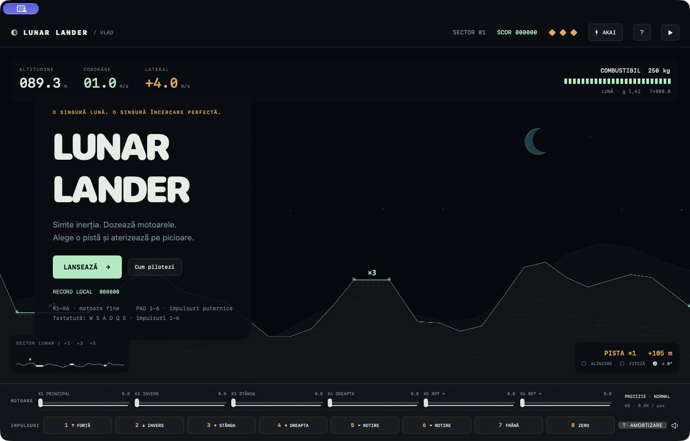
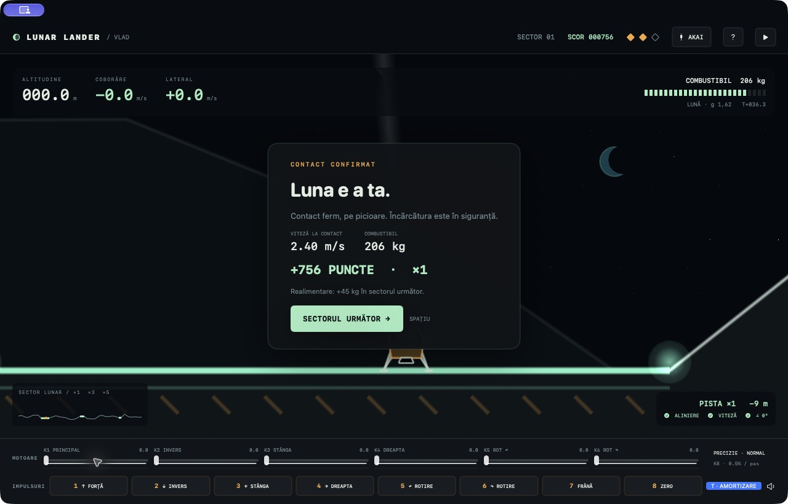

# Lunar Lander · Vlad

Un joc nativ pentru **Mac cu procesor Apple M și macOS 13 sau mai nou**, inspirat de clasicul Lunar Lander. Zbor cu inerție, relief lunar, combustibil limitat și aterizare pe picioare. Creat pentru **AKAI MPK mini IV**: potențiometrele dozează motoarele, padurile dau impulsuri scurte și puternice. Funcționează și cu tastatura și mouse-ul, complet offline.

**[Descarcă jocul pentru Mac](https://github.com/atomicpig/proiectul-de-fizica-al-lui-vlad/releases/latest)** · [Instalare ilustrată](docs/INSTALARE.md)



## Instalare în câteva clicuri

1. Descarcă fișierul **`.dmg`** din pagina de mai sus, nu „Source code”.
2. Deschide-l și trage **Lunar Lander Vlad** în **Applications / Aplicații**.
3. Deschide jocul din Applications. Conectează AKAI prin USB, apoi apasă **Lansează**.

Aplicația este semnată local, fără notarizare Apple. Dacă macOS blochează prima deschidere, mergi la **System Settings → Privacy & Security → Open Anyway**, apoi confirmă **Open**. Excepția se aplică acestei aplicații; nu este nevoie de Terminal. [Instrucțiunile Apple](https://support.apple.com/en-au/102445) explică acest pas. Pe un Mac administrat de școală poate fi necesar ajutorul administratorului.

## Cum joci

Ai **3 vieți** și **250 kg de combustibil**. Alege una dintre cele trei piste luminoase: **×1** este largă, **×3** este mai dificilă, **×5** cere precizie. Aterizarea deschide următorul sector, adaugă până la 45 kg de combustibil și multiplică punctele. Pistele se îngustează progresiv. Recordul se salvează pe Mac.

Motoarele schimbă viteza: reducerea puterii nu oprește deplasarea. Cu nava verticală, **K1 la circa 10–11%** compensează gravitația; ajustează în funcție de combustibil. Pornește cu pista ×1. Lasă inerția să te ducă spre ea, apoi frânează devreme cu Pad 7 și dozează K1.

La contact, ambele picioare trebuie să fie deasupra aceleiași piste: **≤ 6 m/s vertical, ≤ 3 m/s lateral, ≤ 15° înclinare, ≤ 0,5 rad/s rotație**. Suspensia acceptă un contact ferm. O aterizare mai lentă aduce mai multe puncte. Carena nu trebuie să lovească solul.



## Comenzile AKAI

| Control | Acțiune | Alternativă |
|---|---|---|
| K1 / K2 | Motor principal / invers, 0–100% | Cursoare; W / S țin motorul |
| K3 / K4 | Propulsie spre stânga / dreapta | Cursoare; A / D |
| K5 / K6 | Rotație stânga / dreapta | Cursoare; Q / E |
| K7 | Zoom manual | Glisor în `?`; C comută camera automată |
| K8 | Precizia potențiometrelor: 0,1–1% pe pas lent | Glisor în `?`; P comută fin / normal |
| Pad 1–6 | Impuls în aceeași direcție ca K1–K6, **0,24 s la 160%**, adăugat puterii existente | Tastele 1–6 sau butoanele de jos |
| Pad 7 | Frânare cu propulsoare, 0,55 s | 7 / B |
| Pad 8 | Zero: oprește motoarele, impulsurile și amortizarea | 8 / X |
| Pitch / Mod | Rotație fină / puterea clapelor | Q / E; cursoare |
| Clape C D E F G A | Aceleași șase motoare, cât timp ții clapa | W S A D Q E |

**Padurile nu trebuie ținute apăsate.** Fiecare apăsare pornește un impuls finit; așteaptă efectul înainte de următoarea corecție. Frânarea consumă combustibil și nu anulează instantaneu viteza. Modulation nu afectează dials sau paduri.

**Spațiu**: pauză / continuă. **Esc**: pauză. **R**: reia cu confirmare, costă o viață. **T**: amortizează rotația folosind combustibil, păstrând unghiul ales. Pentru ecran complet folosește butonul verde al ferestrei.

### Dacă un potențiometru nu răspunde

Deschide **AKAI**. Folosește modul DAW pe MPK mini IV; dezactivează ARP, LATCH, NOTE REPEAT, CHORDS și SCALES. Profilul implicit folosește K1–K8 de pe portul DAW, iar clapele și padurile de pe portul MIDI. Comanda primită se evidențiază în ecran.

Poți reasocia: alege tipul encoderului, apasă pe funcție și mișcă acel control. Pentru MPK mini IV în modul DAW, folosește **Relativ · +1 / 127**. O asociere include portul, canalul și tipul mesajului. Profilul se salvează automat. La pauză, deconectare sau pierderea focusului, motoarele sunt aduse la zero. Potențiometrele absolute trebuie readuse la zero înainte de reluare.

## Ce înlocuiește

Versiunea 2.0 înlocuiește complet jocul anterior „Proiectul de fizică al lui Vlad”. Adresa repository-ului și pagina de descărcare rămân aceleași. Aplicația are un nume nou; poți elimina vechea aplicație din Applications. Asocierile AKAI salvate se importă automat, cu noile funcții ale padurilor. Recordul începe separat. Misiunile educative și laboratorul vechi nu mai fac parte din joc.

## Pentru dezvoltatori

```sh
swift build
swift run VladLander
bash scripts/test.sh
bash scripts/package.sh
```

Swift 5.9+, Swift Package Manager, macOS 13+. Testele necesită Xcode complet. Fizica din `Sources/FlightCore/` folosește unități SI și pas fix de 1/120 s, separat de UI și de CoreMIDI. Nu există dependențe externe. `VLAD_VERSION=2.0.1 bash scripts/package.sh` schimbă versiunea arhivelor. Vezi [AGENTS.md](AGENTS.md), [verificările](docs/VERIFICARE.md) și [notele versiunii](docs/RELEASE_NOTES.md).

Grafică vectorială și sunete originale. Proiect independent, fără afiliere cu Atari sau AKAI. Cod distribuit sub [licența MIT](LICENSE).
