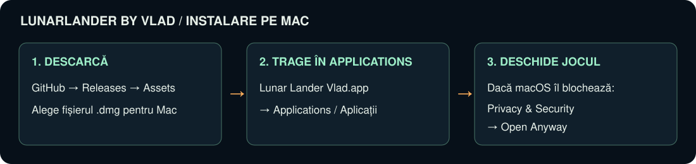
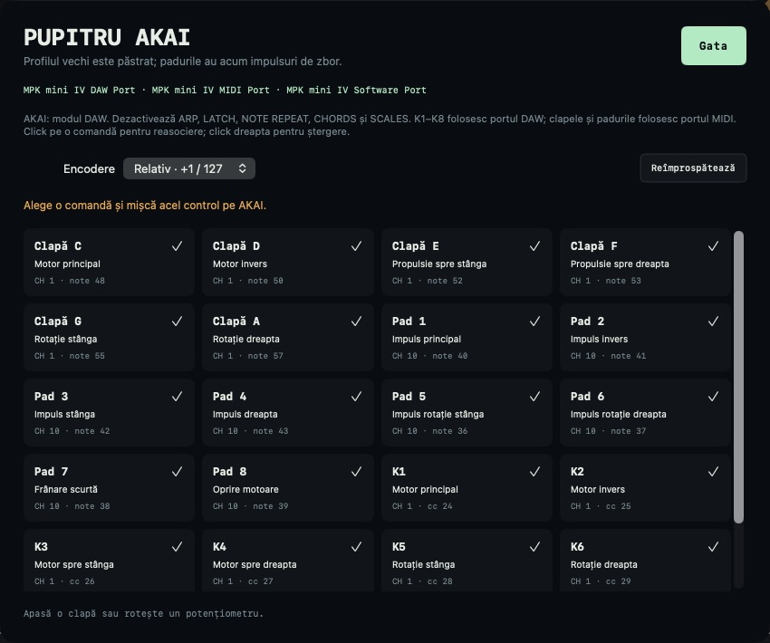

# Instalare pe Mac — LunarLander By Vlad

Ai nevoie de un **Mac cu procesor Apple M1 sau mai nou** și **macOS 13 Ventura sau mai nou**. Verifică în meniul Apple → About This Mac / Despre acest Mac. Nu ai nevoie de Xcode, Terminal, cont sau conexiune la internet după descărcare. Controllerul este opțional.

## 1. Descarcă aplicația

**[Apasă aici pentru descărcarea directă pe Mac (.DMG)](https://github.com/atomicpig/LunarLander-By-Vlad/releases/latest/download/Lunar-Lander-Vlad-2.0.0-macOS-arm64.dmg)**

Deschide **[pagina ultimei versiuni](https://github.com/atomicpig/LunarLander-By-Vlad/releases/latest)**. În lista **Assets**, alege `Lunar-Lander-Vlad-2.0.0-macOS-arm64.dmg`. Fișierele „Source code” sunt pentru dezvoltatori.

Alternativ, descarcă ZIP-ul, deschide-l și mută aplicația rezultată în Applications.

## 2. Mută jocul în Applications

Deschide fișierul DMG din Downloads / Descărcări. Trage **Lunar Lander Vlad.app** peste scurtătura **Applications** din fereastră. Închide fereastra și ejectează volumul din Finder. Deschide jocul din **Applications / Aplicații**, nu din imaginea DMG.

## 3. Prima deschidere

Această versiune are semnătură locală ad-hoc și nu este notarizată de Apple. Dacă apare avertismentul că dezvoltatorul nu poate fi verificat:

1. Închide avertismentul fără să alegi Move to Trash.
2. Deschide **System Settings / Configurări sistem → Privacy & Security / Intimitate și securitate**.
3. Derulează la mesajul despre Lunar Lander Vlad și apasă **Open Anyway / Deschide oricum**.
4. Confirmă **Open / Deschide** și autentifică-te dacă macOS cere.

Urmează acești pași numai pentru copia descărcată din repository-ul de mai sus. [Ghidul oficial Apple](https://support.apple.com/en-au/102445) descrie excepția pentru o singură aplicație. Nu trebuie dezactivate protecțiile Mac-ului. Dacă apare „damaged” sau „will damage your computer”, descarcă din nou arhiva oficială; nu încerca să ocolești acel avertisment. Un Mac administrat poate necesita intervenția administratorului.

## 4. Conectează AKAI și pilotează

Conectează MPK mini IV prin USB. Deschide **AKAI** în joc și verifică dacă potențiometrele se evidențiază când le rotești. Folosește modul DAW și oprește ARP, LATCH, NOTE REPEAT, CHORDS și SCALES. Profilul poate fi reasociat din aceeași fereastră; nu sunt necesare drivere în joc.

- **K1–K6:** motoare dozate fin; puterea rămâne activă până o reduci.
- **Pad 1–6:** impulsuri scurte și puternice în aceleași direcții.
- **Pad 7:** frână; **Pad 8:** toate motoarele la zero.
- **K7:** zoom; **K8:** precizia reglajelor.
- **Spațiu:** pauză / continuă. **?** deschide toate instrucțiunile.

Pentru primul zbor, urmărește pista largă ×1. Nava pornește în deplasare spre dreapta. K1 la aproximativ 10–11% compensează gravitația; folosește Pad 7 pentru a încetini înainte de contact. Redu treptat puterea pentru coborâre. Aterizează pe picioare, la maximum 6 m/s vertical și 3 m/s lateral.

Fără controller: W/S/A/D/Q/E țin motoarele, 1–8 reproduc padurile, iar cele șase cursoare de jos oferă putere continuă. Pierderea focusului pune automat jocul pe pauză și oprește motoarele.

## Actualizare de la jocul anterior

Acesta este un joc nou. Vechea aplicație „Proiectul de fizică al lui Vlad” poate fi mutată în Coș. Asocierile AKAI se importă automat; padurile au acum funcții de impuls. Scorurile vechi nu sunt compatibile. Pentru actualizările viitoare închide jocul înainte să înlocuiești aplicația din Applications.
